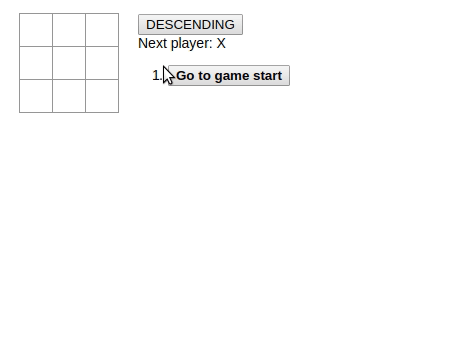

# React Tutorial

https://reactjs.org/tutorial/tutorial.html

Running on Linux:
```
npm install && npm run start
```
I added watch to package.json so that npm rebuilds the app each time a file in /src is modified, which helps developing.



